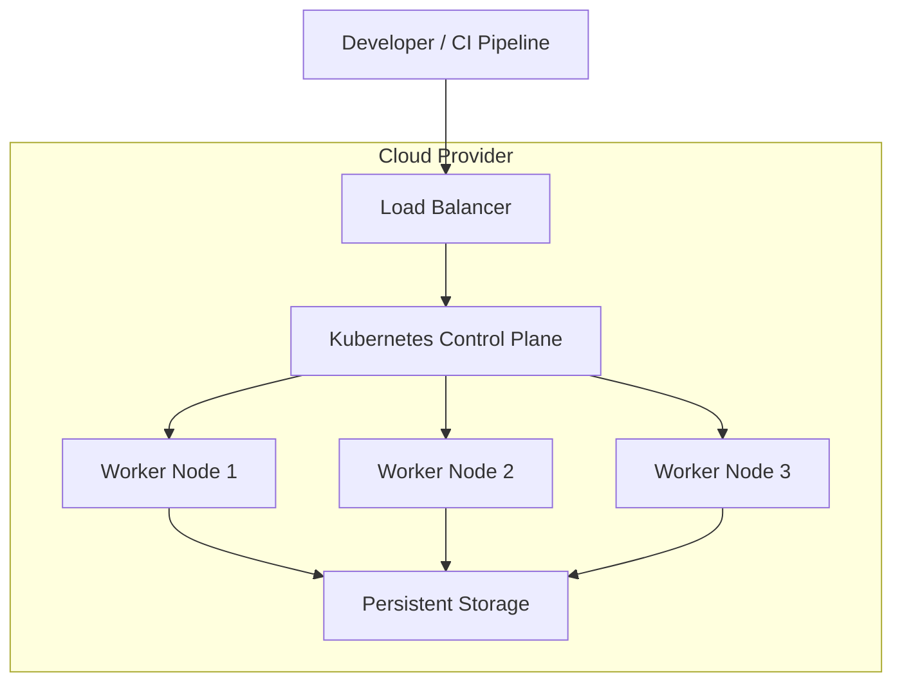

# Multi-cloud-k8s-cost-analysis
Multi-cloud Kubernetes cost and architecture comparison (AWS EKS, GCP GKE, OCI OKE) focused on Dev/Test cluster financial and operational trade-offs.

```mermaid
flowchart TB

    User[Developer / CI Pipeline]

    subgraph Cloud Provider
        LB[Load Balancer]
        CP[Kubernetes Control Plane]
        N1[Worker Node 1]
        N2[Worker Node 2]
        N3[Worker Node 3]
        Storage[Persistent Storage]
    end

    User --> LB
    LB --> CP
    CP --> N1
    CP --> N2
    CP --> N3
    N1 --> Storage
    N2 --> Storage
    N3 --> Storage
```
